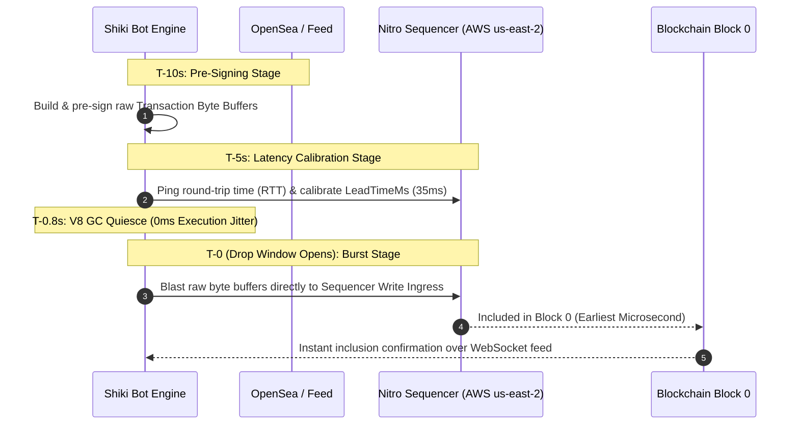

# ⚡ Shiki Labs — Ultra-Fast NFT Sniper & 24/7 Mobile Control Daemon (v4.0)

> **High-Performance, Multi-Wallet, Multi-RPC Automated NFT Mint Sniper & Asset Sweeper for Robinhood Chain (Arbitrum Orbit L2), Base, Arbitrum, Optimism & Ethereum Mainnet.**

Control and execute high-speed NFT mints directly from your phone over Telegram 24/7, or run interactively via the terminal CLI.

---

## 📑 Table of Contents

1. [✨ Key Capabilities](#-key-capabilities)
2. [📱 24/7 Telegram Mobile Daemon](#-247-telegram-mobile-daemon)
3. [⚡ Speed & Sequencer Ingress Architecture](#-speed--sequencer-ingress-architecture)
4. [📦 Asset Sweeper & Consolidation Tool](#-asset-sweeper--consolidation-tool)
5. [📊 Mint Analytics & Telemetry Engine](#-mint-analytics--telemetry-engine)
6. [🚀 Quickstart Guide (Local PC)](#-quickstart-guide-local-pc)
7. [☁️ 24/7 AWS EC2 Cloud Deployment Guide](#️-247-aws-ec2-cloud-deployment-guide)
8. [⚙️ Environment Configuration (`.env`)](#-environment-configuration-env)
9. [🔒 Security Best Practices](#-security-best-practices)

---

## ✨ Key Capabilities

| Feature | What It Does | Why It Gives You an Edge |
|---|---|---|
| **🏹 Direct Sequencer Ingress** | Sends transactions directly to the Arbitrum Nitro sequencer in AWS us-east-2 | Bypasses Cloudflare & public read-replicas (~25ms speed advantage) |
| **📱 24/7 Telegram Daemon** | Interactive tap-based mobile dashboard with background job scheduling | Arm drops, check balances, and sweep NFTs from anywhere in the world |
| **⚡ Pre-Signed Raw Byte Buffers** | Pre-computes and signs raw transaction bytes at T-10s | 0ms CPU derivation or signing lag at T-0 burst |
| **🔄 `NotActive()` Micro-Burst Ladder** | Detects timing drift and fires pre-signed backups at `0ms`, `120ms`, and `240ms` | Automatically recovers and wins if you land 1ms before the opening block |
| **🛡️ On-Chain Price Watchdog** | Re-verifies drop price at T-15s directly on smart contract | Protects against creators stealth-changing free drops to paid drops |
| **📦 Selective Asset Sweeper** | Consolidates minted NFTs and drains leftover ETH to your main wallet | 1-click move tokens and funds from all burner wallets to cold storage |
| **📊 Real-Time Gas & Gwei Feed** | Queries live on-chain Base Fee in Gwei across all menus | Always know current gas conditions on L1 and L2 networks |
| **🏎️ Multi-RPC Parallel Racing** | Broadcasts across Sequencer, Alchemy, and Ankr nodes simultaneously | Fastest node confirms first with zero dropped packets |

---

## 📱 24/7 Telegram Mobile Daemon

The bot includes a built-in 24/7 Telegram Daemon that gives you full remote control from your phone:

```
                  ┌─────────────────────────────────────────┐
                  │ ⚡ Shiki Labs Remote Control Dashboard │
                  └─────────────────────────────────────────┘
                                       │
            ┌──────────────────────────┴──────────────────────────┐
            ▼                                                     ▼
┌───────────────────────┐                             ┌───────────────────────┐
│  🎯 NFT SNIPER TOOLS  │                             │ 💼 WALLET MANAGEMENT  │
├───────────────────────┤                             ├───────────────────────┤
│ • /snipe <contract>   │                             │ • /generate <count>   │
│ • /drops (Scheduled)  │                             │ • /fund <amount>      │
│ • /stats (Benchmarks) │                             │ • /balance (Live Gwei)│
│ • /export (JSON Log)  │                             │ • /sweep (NFTs + ETH) │
│ • /status (RAM & Uptime│                            │ • /wallets (List)     │
└───────────────────────┘                             └───────────────────────┘
```

### 🎯 NFT Sniper Commands:
* **`/snipe <contract|slug>`**: 5-step tap wizard:
  1. Network Selection (Robinhood, Base, Arbitrum, Mainnet)
  2. Mint Mode (Public SeaDrop, Allowlist/FCFS, Check Eligibility)
  3. **Wallet Selection** (`All Wallets`, `Funded Only`, or Individual Wallets with live balances)
  4. Quantity per Wallet (1, 2, 3, 5)
  5. Timing (Immediate, On-Chain Auto-Sync, Custom Time)
* **`/drops`**: View all active background scheduled drops with countdowns and 1-tap cancel buttons.
* **`/stats`**: View your lifetime on-chain mint performance, average block latency, gas spent (ETH & USD), and top collections.
* **`/export`**: Download your complete `mint-history.json` directly into Telegram.
* **`/status`**: Check daemon uptime, memory usage, and live network Base Fee in Gwei.

### 💼 Wallet Management Commands:
* **`/generate <count>`**: Creates fresh burner wallets and automatically **appends them to master `wallets.txt`**.
* **`/fund <amount>`**: Sequentially auto-distributes gas from your Master Wallet to all active burners.
* **`/balance`**: View real-time ETH and USD balances, nonces, and live Gwei for all wallets.
* **`/sweep`**: Interactive asset sweeper to transfer NFTs and drain leftover ETH back to your main wallet.
* **`/wallets`**: List masked addresses of all active session wallets.

---

## ⚡ Speed & Sequencer Ingress Architecture

On FIFO (First-Come, First-Served) L2 networks like **Robinhood Chain** and **Base**, gas auctions cannot buy priority. Arrival order at the sequencer determines who gets the NFT.



---

## 📦 Asset Sweeper & Consolidation Tool

Consolidate all minted NFTs and leftover gas from temporary burner wallets to your primary/cold wallet in one command (`/sweep`):

1. **Selective NFT Transfer**:
   - `[⚡ Sweep ALL NFTs]` — Transfers all owned NFTs across all burners.
   - `[🖼️ By Collection]` — Transfers only tokens from a selected collection (e.g. *"Tch"*).
   - `[🔢 By Individual Token ID]` — Transfers specific tokens one by one.
2. **Leftover ETH Drain**:
   - Calculates exact gas fee (21,000 gas) and transfers **100% of remaining ETH** back to your master wallet.
3. **Flexible Recipient**:
   - Uses pre-configured `RECIPIENT_ADDRESS` from `.env` or prompts for any custom `0x...` address.

---

## 📊 Mint Analytics & Telemetry Engine

Every drop attempt automatically records structured telemetry to `mint-history.json`:

* **Minted Token IDs** extracted directly from on-chain `Transfer` event logs.
* **Millisecond Arrival Latency** measured from T-0 to block inclusion.
* **Gas Telemetry**: Gas Units Used, Effective Gas Price (Gwei), and total ETH/USD cost.
* **Revert Reason Decoding**: Automatically decodes on-chain reverts for tuning.

---

## 🚀 Quickstart Guide (Local PC)

### 1. Prerequisites
* [Node.js](https://nodejs.org/) (v18 or higher)
* [Git](https://git-scm.com/)

### 2. Clone & Install
```bash
git clone https://github.com/Bulldozer34/skiki_labs.git
cd skiki_labs
npm install
```

### 3. Configure Environment
Copy the example configuration file:
```bash
cp .env.example .env
```
Open `.env` and fill in your keys (see [Environment Configuration](#-environment-configuration-env)).

### 4. Launch Options

* **Option A: 24/7 Telegram Mobile Daemon** *(Recommended)*:
  ```bash
  npm run daemon
  ```
  Open Telegram, send `/start` to your bot, and control everything from your phone!

* **Option B: Interactive CLI**:
  ```bash
  npm start
  ```

---

## ☁️ 24/7 AWS EC2 Cloud Deployment Guide

Running on an AWS EC2 instance in **US-East (Ohio / Virginia)** places your bot directly next to the Robinhood & Base sequencers for sub-5ms network ping.

### Step 1: Launch an AWS EC2 Instance
1. Go to AWS Console ➔ EC2 ➔ **Launch Instance**.
2. **OS:** Ubuntu 24.04 LTS (or Amazon Linux 2023).
3. **Instance Type:** `t3.small` or `t3.medium`.
4. **Region:** `us-east-2 (Ohio)` *(Matches Robinhood Nitro Sequencer location)*.

### Step 2: Install Node.js, Git & PM2
Connect to your EC2 instance via SSH and run:
```bash
sudo apt update && sudo apt upgrade -y
curl -fsSL https://deb.nodesource.com/setup_20.x | sudo -E bash -
sudo apt install -y nodejs git
sudo npm install -g pm2
```

### Step 3: Clone & Configure
```bash
git clone https://github.com/Bulldozer34/skiki_labs.git
cd skiki_labs
npm install
nano .env  # Paste your API keys, Bot Token & Chat ID
nano wallets.txt  # Paste your private keys (1 per line)
```

### Step 4: Start with PM2 (24/7 Auto-Restart)
```bash
pm2 start daemon.js --name "shiki-daemon"
pm2 save
pm2 startup
```

### Step 5: Updating Code from GitHub (10-Second Update)
Whenever you push new updates to GitHub, simply run on your EC2 instance:
```bash
git pull
pm2 restart shiki-daemon
```

---

## ⚙️ Environment Configuration (`.env`)

```env
# ─── OPENSEA API & GQL ─────────────────────────────────────────
OPENSEA_GQL_URL=https://gql.opensea.io/graphql/
OPENSEA_AUTH_URL=https://auth.opensea.io
OPENSEA_API_URL=https://api.opensea.io
OPENSEA_API_KEY=your_opensea_api_key_here
X_APP_ID=os2-web

# ─── BLOCKCHAIN RPC & API KEYS ─────────────────────────────────
ALCHEMY_KEY=your_alchemy_api_key
ANKR_KEY=your_ankr_api_key
ETHERSCAN_KEY=your_etherscan_key

# ─── TELEGRAM BOT REMOTE CONTROL ──────────────────────────────
TELEGRAM_BOT_TOKEN=your_bot_token_from_botfather
TELEGRAM_CHAT_ID=your_numeric_chat_id_from_userinfobot

# ─── MASTER WALLET FOR AUTO-FUNDING ────────────────────────────
MASTER_WALLET_PRIVATE_KEY=0x_your_funding_wallet_private_key

# ─── DEFAULT RECIPIENT FORWARDING & SWEEPER ───────────────────
RECIPIENT_ADDRESS=0x_your_cold_storage_or_main_wallet_address

# ─── SPEED & LATENCY TUNING ───────────────────────────────────
SNIPER_LEAD_TIME_MS=35
SNIPER_PRIORITY_BOOST=1

# ─── DEFAULT NETWORK ───────────────────────────────────────────
DEFAULT_CHAIN=ROBINHOOD
DEFAULT_RPC_URL=https://rpc.mainnet.chain.robinhood.com
```

---

## 🔒 Security Best Practices

1. **Always Use Burner Wallets**: Never use your primary life-savings wallet for high-speed minting. Keep only the necessary mint gas in burners.
2. **Auto-Forward to Cold Storage**: Set `RECIPIENT_ADDRESS` in `.env` and use `/sweep` to immediately transfer valuable NFTs to your hardware/cold wallet.
3. **Private Key Protection**: `.env`, `wallets.txt`, and log files are strictly `.gitignored` to ensure secrets are never committed to version control.
4. **Telegram Allowlist**: The bot strictly discards messages from any Telegram user whose ID does not match `TELEGRAM_CHAT_ID`.

---

## 📄 License
MIT License. Built for high-speed automated Web3 execution.
